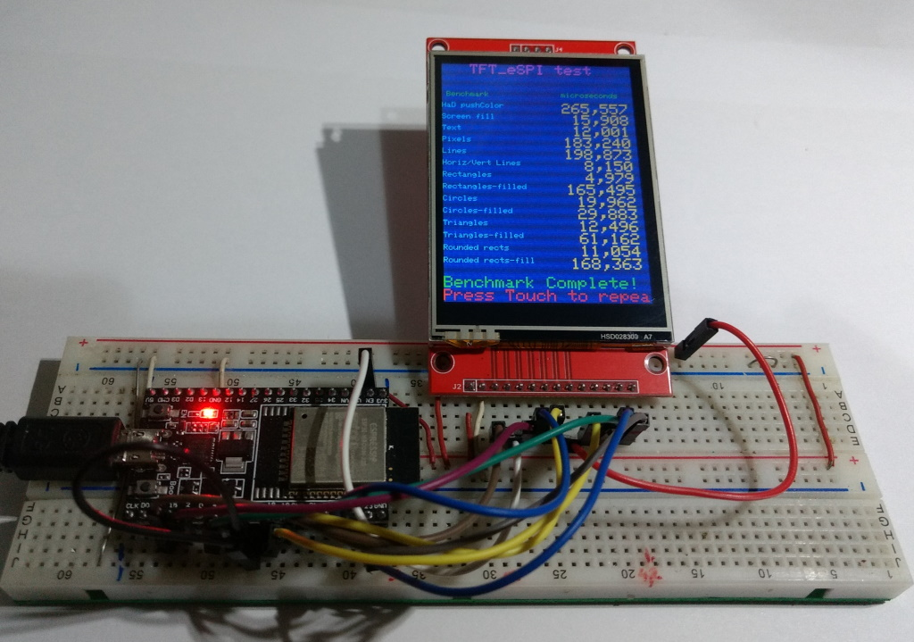

# SPI Touch Display ili9341 2.8" 320x240 XPT2046

Aliexpress Display ~8€, tested with a ESP32 DevKitC V4 and Arduino IDE 2.0.4

Display works with TFT_eSPI by Bodmer, LovyanGFX and LVGL 8.3.6 

Speed about 32.4fps(40MHz), 63.0 fps (80MHz)


## Connections for ESP32 DevKitC V4

Share SPI MOSI, MISO and CLK, so you need only 11 Pin's for 3 SPI devices.

| GPIO | TFT   | Touch | SD-Card |                |
| ---: | :---- | :---- | :------ | :------------- |
| 23   | SDI   | T_DIN | SD_MOSI | MOSI           |
| 19   |(SDO)  | T_DO  | SD_MISO | MISO           |
| 18   | SCK   | T-CLK | SD_SCK  | CLK            |
|  2   | DC    |       |         | DC             |
| EN   | RESET |       |         | RST            |
| 15   | CS    |       |         | CS  (TFT)      |
|  5   |       |       | SD_CS   | CS  (SD)       |
|  4   |       | T_CS  |         | CS  (Touch)    |
|      |       | T_IRQ |         | IRQ (not used) |
|      | GND   |       |         | GND            |
|      | VCC   |       |         | 3.3V           |
|      | LED   |       |         | 3.3V           |

## Install and configure the library TFT_eSPI 2.5.0
- Edit the file : Arduino\libraries\TFT_eSPI\User_Setup.h
- Test : TFT_graphicstest_PDQ_ili9341_Touch.ino (works with TFT_eSPI or LovyanGFX)



Edit Arduino\libraries\TFT_eSPI\User_Setup.h :

```java
#define USER_SETUP_INFO "User_Setup"

// Driver
#define ILI9341_DRIVER

// Pins
#define TFT_MISO 19
#define TFT_MOSI 23
#define TFT_SCLK 18
#define TFT_CS   15
#define TFT_DC    2
#define TFT_RST  -1
#define TOUCH_CS  4

// Fonts
#define LOAD_GLCD
#define LOAD_FONT2
#define LOAD_FONT4
#define LOAD_FONT6
#define LOAD_FONT7
#define LOAD_FONT8
//#define LOAD_FONT8N
#define LOAD_GFXFF
#define SMOOTH_FONT

//Other options
#define SPI_FREQUENCY       40000000 // 32.4 fps works fine
//#define SPI_FREQUENCY     80000000 // 63.0 fps works fine but problems with examples, that use DMA.

#define SPI_READ_FREQUENCY  20000000
#define SPI_TOUCH_FREQUENCY  2500000

```
Speedtest : Arduino\libraries\TFT_eSPI\examples\DMA test\Bouncy_Circles\Bouncy_Circles.ino

## Alternative configuration of the library TFT_eSPI 2.5.0
- Create the new File : Arduino\libraries\TFT_eSPI\User_Setups\Setup402_ILI9341_Touch.h
- Edit the file : Arduino\libraries\TFT_eSPI\User_Setup_Select.h

Edit Arduino\libraries\TFT_eSPI\User_Setup_select.h :
```java

// Only **ONE** line below should be uncommented to define your setup.

//#include <User_Setup.h>                        // Default setup is root library folder
#include <User_Setups/Setup402_ILI9341_Touch.h>  // new : Setup file for ST7735 with touch
```

## Install and configure the library LovyanGFX 1.1.5
- Create the file : Arduino\libraries\LovyanGFX\src\LGFX_ESP32_ILI9341.hpp
- Test : TFT_graphicstest_PDQ3_Touch.ino


LGFX_ESP32_ILI9341.hpp :

```c++
#pragma once

#define  LGFX_USE_V1

#include <LovyanGFX.hpp>

class LGFX :  public lgfx::LGFX_Device
{
  lgfx::Panel_ILI9341  _panel_instance;
  lgfx::Bus_SPI        _bus_instance;
  lgfx::Touch_XPT2046  _touch_instance;
public:
  LGFX(void)
  { // Configure bus control settings.

      auto cfg = _bus_instance.config();
      cfg.spi_host = VSPI_HOST;
      cfg.spi_mode    = 0;
      cfg.freq_write  = 40000000;  // 80000000 
      cfg.freq_read   = 16000000;
      cfg.spi_3wire   = true;
      cfg.use_lock    = true;
      cfg.dma_channel = SPI_DMA_CH_AUTO;
      cfg.pin_sclk = 18;            // SPI SCLK
      cfg.pin_mosi = 23;            // SPI MOSI
      cfg.pin_miso = 19;            // SPI MISO    (-1 = disable)
      cfg.pin_dc   =  2;            // SPI D/C A0  (-1 = disable)
      
      _bus_instance.config(cfg);
      _panel_instance.setBus(&_bus_instance);
    }
    { // Set display panel controls.

      auto cfg = _panel_instance.config();

      cfg.pin_cs           =    15;  // CS    (-1 = disable)
      cfg.pin_rst          =    -1;  // RST   (-1 = disable)
      cfg.pin_busy         =    -1;  // BUSY  (-1 = disable)

      cfg.panel_width      =   240;
      cfg.panel_height     =   320;
      cfg.offset_x         =     0;
      cfg.offset_y         =     0;
      cfg.offset_rotation  =     2;
      cfg.dummy_read_pixel =     8;
      cfg.dummy_read_bits  =     1;
      cfg.readable         =  true;
      cfg.invert           = false;
      cfg.rgb_order        = false;
      cfg.dlen_16bit       = false;
      cfg.bus_shared       =  true;

      _panel_instance.config(cfg);
    }
    { // Configure settings for touch screen control.  (delete if not necessary)

      auto cfg = _touch_instance.config();

      cfg.x_min      =   0;    // numbers doesn't work
      cfg.x_max      = 127;
      cfg.y_min      =   0;
      cfg.y_max      = 159;
    //cfg.pin_int    =  -1;
      cfg.bus_shared = true;
      cfg.offset_rotation = 0;

      _touch_instance.config(cfg);
      _panel_instance.setTouch(&_touch_instance); // Set the touchscreen to the panel.
    }
    setPanel(&_panel_instance); // Sets the panel to use.
  }
};
```
## Install and configure LVGL 8.3.6 
- First install and configure the Library TFT_eSPI. 
- Install only LVGL 8.3.6 "Note that the examples and demos are now part of the main LVGL library."
- Create and edit the file : "Arduino\libraries\lv_conf.h"
  - copy "Arduino\libraries\lvgl\lv_conf_template.h" to "Arduino\libraries\lv_conf.h"
  - Edit "Arduino\libraries\lv_conf.h"
- Modify the lvgl library :
  - Copy the demos folder "Arduino\libraries\lvgl\demos" to "Arduino\libraries\lvgl\ **src**\demos"
- Test : LVGL_Arduino_rx (where x is the rotation)

LVGL_Arduino_rx is the original LVGL_demo.ino of LVGL 8.3.6 with all modifications i needed to compile and get the touch working correctly with Arduino IDE 2.0.4, TFT_eSPI and ili9341.

> Display works perfect with 40MHz. With 80MHz there are some distortions may be because LVGL uses DMA.

LVGL_Arduino_r0 :


LVGL_Arduino_r1 :


Modified lines in Arduino\libraries\lv_conf.h :
```java
#if 1                            /* Set it to "1" to enable content */
#define LV_COLOR_DEPTH 16
#define LV_TICK_CUSTOM 1         // Touch works only with 1
#define LV_USE_LOG 1             // See the LVGL-warnings in the serial monitor
#define LV_FONT_MONTSERRAT_12 1 
#define LV_FONT_MONTSERRAT_14 1
#define LV_FONT_MONTSERRAT_18 1
#define LV_FONT_DEFAULT &lv_font_montserrat_12
#define LV_USE_DEMO_WIDGETS 1                   // Enable demos
#define LV_DEMO_WIDGETS_SLIDESHOW 1
#define LV_USE_DEMO_KEYPAD_AND_ENCODER 1
#define LV_USE_DEMO_BENCHMARK 1
#define LV_USE_DEMO_STRESS 1
```

## Using the examples included in LVGL 8.3.6 
- Modify the lvgl library :
  - Copy the examples folder "Arduino\libraries\lvgl\examples" to "Arduino\libraries\lvgl\src\examples"
- Test : LVGL_Arduino_r0_examples ( lv_example_msgbox_1(); )

LVGL_Arduino_r1 :


<!-- unvisible -->
