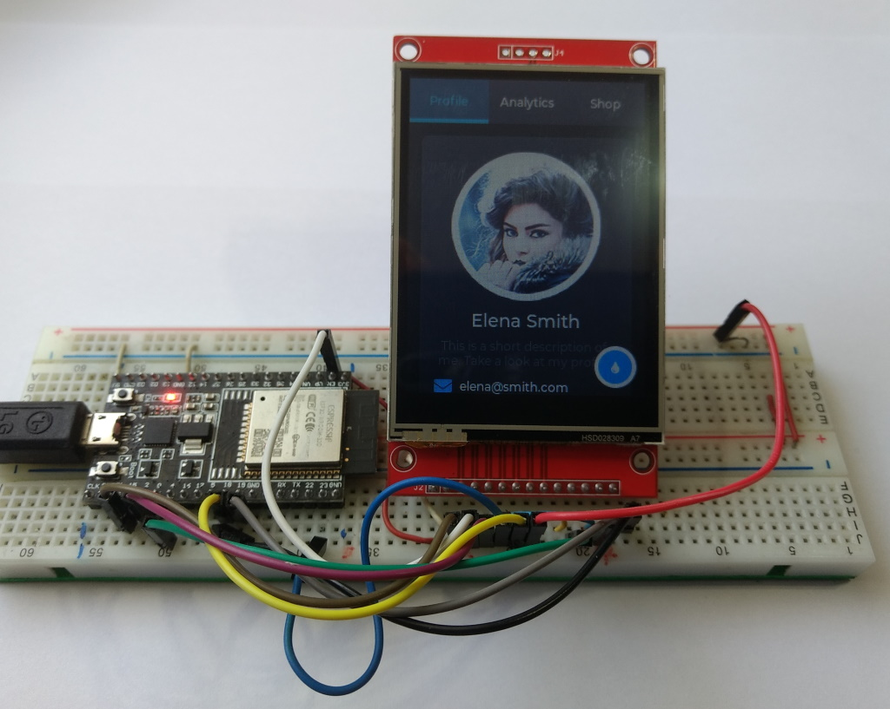

# SPI Touch Display ili9341 2.8" 320x240 XPT2046

Aliexpress Display ~8€, tested with a ESP32 DevKitC V4 and Arduino IDE 2.0.4 / [PlatformIO](#pla)

Display works with [TFT_eSPI by Bodmer](#espi), [LovyanGFX](#lov) and [LVGL 8.3.6](#lvgl)

Speed Bouncy_Circles : about 32fps(40MHz), 63fps(80MHz), boing_ball : 105fps(40MHz)


## Connections for ESP32 DevKitC V4

Share SPI MOSI, MISO and CLK, so you need only 11 Pin's for 3 SPI devices.

| GPIO | TFT   | Touch | SD-Card |                |
| ---: | :---- | :---- | :------ | :------------- |
| 23   | SDI   | T_DIN | SD_MOSI | MOSI           |
| 19   |(SDO)  | T_DO  | SD_MISO | MISO           |
| 18   | SCK   | T-CLK | SD_SCK  | CLK            |
|  2   | DC    |       |         | DC             |
| EN   | RESET |       |         | RST            |
| 15   | CS    |       |         | CS  (TFT)      |
|  5   |       |       | SD_CS   | CS  (SD)       |
|  4   |       | T_CS  |         | CS  (Touch)    |
|      |       | T_IRQ |         | IRQ (not used) |
|      | GND   |       |         | GND            |
|      | VCC   |       |         | 3.3V           |
|      | LED   |       |         | 3.3V           |

TFT_SDO works stable with 16MHz (TFT_ReadWrite_Test.ino).

## Install and configure the library TFT_eSPI 2.5.0 <a name="espi"></a>
- Default Windows Arduino folder : C:\Users\<username>\Documents\Arduino
- Edit the file : Arduino\libraries\TFT_eSPI\User_Setup.h ( [Link](/Arduino/libraries/TFT_eSPI/User_Setup.h) )
- Test : [TFT_graphicstest_PDQ_ili9341_Touch](/Arduino/TFT_graphicstest_PDQ_ili9341_Touch/TFT_graphicstest_PDQ_ili9341_Touch.ino) (works with TFT_eSPI or LovyanGFX)


Edit Arduino\libraries\TFT_eSPI\User_Setup.h :

```java
#define USER_SETUP_INFO "User_Setup"

// Driver
#define ILI9341_DRIVER

// Pins
#define TFT_MISO 19
#define TFT_MOSI 23
#define TFT_SCLK 18
#define TFT_CS   15
#define TFT_DC    2
#define TFT_RST  -1
#define TOUCH_CS  4

// Fonts
#define LOAD_GLCD
#define LOAD_FONT2
#define LOAD_FONT4
#define LOAD_FONT6
#define LOAD_FONT7
#define LOAD_FONT8
//#define LOAD_FONT8N
#define LOAD_GFXFF
#define SMOOTH_FONT

//Other options
#define SPI_FREQUENCY       40000000 // 32.4 fps works fine
//#define SPI_FREQUENCY     80000000 // 63.0 fps works fine but problems with examples that use DMA (?).

#define SPI_READ_FREQUENCY  16000000 // 20000000 unstable
#define SPI_TOUCH_FREQUENCY  2500000

```

## Alternative configuration of the library TFT_eSPI 2.5.0
- Create a new file with your configuration data : Arduino\libraries\Setup402_ILI9341_Touch.h ( [Link](/Arduino/libraries/Setup402_ILI9341_Touch.h) )
- Edit the file : Arduino\libraries\TFT_eSPI\User_Setup_Select.h ( [Link](/Arduino/libraries/TFT_eSPI/User_Setup_Select.h) )

Edit User_Setup_select.h :
```java
// Only **ONE** line below should be uncommented to define your setup.

//#include <User_Setup.h>                       // Default setup in root library folder

// Setup file in folder Arduino/libraries (updates will not overwrite your setups)
//#include <../Setup401_ST7735_Touch.h>         // new : Setup file for  ST7735 1.8" with touch, ST7735_GREENTAB2
#include <../Setup402_ILI9341_Touch.h>          // new : Setup file for ili9341 2.8" with touch, 40MHz
//#include <../Setup403_ILI9341_Touch_80MHz.h>  // new : Setup file for ili9341 2.8" with touch, 80MHz
```

## Install and configure the library LovyanGFX 1.1.5 <a name="lov"></a>
- Create the file : Arduino\libraries\LovyanGFX\src\LGFX_ESP32_ILI9341.hpp ( [Link](/Arduino/libraries/LovyanGFX/src/LGFX_ESP32_ILI9341.hpp) )
- Test : [Lovyan_Touch_Test](/Arduino/Lovyan_Touch_Test/Lovyan_Touch_Test.ino) and [TFT_graphicstest_PDQ_ili9341_Touch](/Arduino/TFT_graphicstest_PDQ_ili9341_Touch/TFT_graphicstest_PDQ_ili9341_Touch.ino)


LGFX_ESP32_ILI9341.hpp :

```c++
#pragma once

#define  LGFX_USE_V1

#include <LovyanGFX.hpp>

class LGFX :  public lgfx::LGFX_Device
{
  lgfx::Panel_ILI9341  _panel_instance;
  lgfx::Bus_SPI        _bus_instance;
  lgfx::Touch_XPT2046  _touch_instance;
public:
  LGFX(void)
  { // Configure bus control settings.

      auto cfg = _bus_instance.config();
      cfg.spi_host = VSPI_HOST;
      cfg.spi_mode    = 0;
      cfg.freq_write  = 40000000;  // 80000000 
      cfg.freq_read   = 16000000;
      cfg.spi_3wire   = true;
      cfg.use_lock    = true;
      cfg.dma_channel = SPI_DMA_CH_AUTO;
      cfg.pin_sclk = 18;            // SPI SCLK
      cfg.pin_mosi = 23;            // SPI MOSI
      cfg.pin_miso = 19;            // SPI MISO    (-1 = disable)
      cfg.pin_dc   =  2;            // SPI D/C A0  (-1 = disable)
      
      _bus_instance.config(cfg);
      _panel_instance.setBus(&_bus_instance);
    }
    { // Set display panel controls.

      auto cfg = _panel_instance.config();

      cfg.pin_cs           =    15;  // CS    (-1 = disable)
      cfg.pin_rst          =    -1;  // RST   (-1 = disable)
      cfg.pin_busy         =    -1;  // BUSY  (-1 = disable)

      cfg.panel_width      =   240;
      cfg.panel_height     =   320;
      cfg.offset_x         =     0;
      cfg.offset_y         =     0;
      cfg.offset_rotation  =     2;
      cfg.dummy_read_pixel =     8;
      cfg.dummy_read_bits  =     1;
      cfg.readable         =  true;
      cfg.invert           = false;
      cfg.rgb_order        = false;
      cfg.dlen_16bit       = false;
      cfg.bus_shared       =  true;

      _panel_instance.config(cfg);
    }
    { // Configure settings for touch screen control.  (delete if not necessary)

      auto cfg = _touch_instance.config();

      cfg.x_min      =   0;    // numbers doesn't work
      cfg.x_max      = 127;
      cfg.y_min      =   0;
      cfg.y_max      = 159;
    //cfg.pin_int    =  -1;
      cfg.bus_shared = true;
      cfg.offset_rotation = 0;

      _touch_instance.config(cfg);
      _panel_instance.setTouch(&_touch_instance); // Set the touchscreen to the panel.
    }
    setPanel(&_panel_instance); // Sets the panel to use.
  }
};
```
## Install and configure LVGL 8.3.6 <a name="lvgl"></a>
- First install and configure the Library TFT_eSPI. 
- Install only LVGL 8.3.6 library "Note that the examples and demos are now part of the main LVGL library."
- Create and edit the file : "Arduino\libraries\lv_conf.h"
  - copy "Arduino\libraries\lvgl\lv_conf_template.h" to "Arduino\libraries\lv_conf.h"
  - Edit "Arduino\libraries\lv_conf.h"  ( [Link](/Arduino/libraries/lv_conf.h) )
- Modify the lvgl library :
  - Copy the demos folder "Arduino\libraries\lvgl\demos" to "Arduino\libraries\lvgl\ **src**\demos"
  - Copy the examples folder "Arduino\libraries\lvgl\examples" to "Arduino\libraries\lvgl\ **src**\examples"
- Test : [LVGL_Arduino_rx](/Arduino/LVGL_Arduino_rx/LVGL_Arduino_rx.ino)
  - different rotation : modify the line "#define SCREEN_ROTATION **0**"
  - try other demo or example : uncomment **ONE** of the lines starting with "lv_demo_" or "lv_example_"

LVGL_Arduino_rx is the original LVGL_demo.ino of LVGL 8.3.6 with all modifications i needed to compile without errors and get the touch working correctly with Arduino IDE 2.0.4, TFT_eSPI and ili9341.

> Display works perfect with 40MHz. With 80MHz there are some distortions maybe because LVGL uses DMA.

LVGL_Arduino_rx with rotation 0 and lv_demo_widgets();


LVGL_Arduino_rx with rotation 1  and lv_demo_widgets();


LVGL_Arduino_rx with rotation 0 and lv_example_msgbox_1();

- Doku : https://docs.lvgl.io/master/examples.html

Modified lines in Arduino\libraries\lv_conf.h :
```java
#if 1                            /* Set it to "1" to enable content */
#define LV_COLOR_DEPTH 16
#define LV_TICK_CUSTOM 1         // Touch works only with 1
#define LV_USE_LOG 1             // See the LVGL-warnings in the serial monitor
#define LV_FONT_MONTSERRAT_12 1 
#define LV_FONT_MONTSERRAT_14 1
#define LV_FONT_MONTSERRAT_18 1
#define LV_FONT_DEFAULT &lv_font_montserrat_12
#define LV_USE_DEMO_WIDGETS 1                   // Enable demos
#define LV_DEMO_WIDGETS_SLIDESHOW 1
#define LV_USE_DEMO_KEYPAD_AND_ENCODER 1
#define LV_USE_DEMO_BENCHMARK 1
#define LV_USE_DEMO_STRESS 1
```

## Use Visual Studio Code and PlatformIO <a name="pla"></a>

Test PlatformIO with the TFT_eSPI graphicstest example :
- Default Windows PlatformIO folder : C:\Users\<username>\Documents\PlatformIO
- Install Visual Studio Code and PlatformIO
  - https://platformio.org/install/ide?install=vscode
- Create a new project in PlatformIO
  - Press PIO Home  then click on .  ( [screenshot](/pictures/PlatformIO_New_Project.jpg) ).
  - Name : ili9341_graphicstest_PDQ
  - Board : Espressif ESP32 Dev Module
  - Framework : Arduino Framework
- Edit [platformio.ini](/PlatformIO/Projects/ili9341_graphicstest_PDQ/platformio.ini) ! ( [screenshot](/pictures/PlatformIO_main.jpg) )
- Edit [src/main.cpp](/PlatformIO/Projects/ili9341_graphicstest_PDQ/src/main.cpp) ( [screenshot](/pictures/PlatformIO_platform.ini.jpg) ) 
- Before uploading :
  - If necessary set environment to 
  - Connect the ESP32 DevKitC v4
- Upload (Press 
  ) ( [screenshot](/pictures/PlatformIO_Upload.jpg) )

Use PlatformIO with the LVGL Arduino Demo :

- Create a new project in PlatformIO
  - Name : LVGL_Demo
  - Board : Espressif ESP32 Dev Module
  - Framework : Arduino Framework
- Edit [platformio.ini](/PlatformIO/Projects/LVGL_Demo/platformio.ini )
- Edit [main.c](/PlatformIO/Projects/LVGL_Demo/src/main.cpp )
- In the folder "PlatformIO\Projects\LVGL_Demo\.pio\libdeps\esp32dev\lvgl\"
  - copy the folder "demos" to "src\demos"
  - copy the folder "examples" to "src\examples"
- Modify src/main.cpp (not necessary) : 
  - different rotation : modify the line "#define SCREEN_ROTATION **0**"
  - try other demo or example : uncomment **ONE** of the lines starting with "lv_demo_" or "lv_example_"
- Before uploading :
  - If necessary set environment to "Default (LVGL_Demo)"
  - Connect the ESP32 DevKitC v4
- Upload  ( [screenshot](/pictures/PlatformIO_Upload_LVGL.jpg) ) 

LVGL_Arduino_rx with rotation 0  and lv_demo_widgets();


## Use  PlatformIO with lv_conf.h , User_Setup.h and User_Setup_Select.h
- No build_flags nesessary in platform.ini for TFT_eSPI and lvgl (see below)
- The library folder [/PlatformIO/Projects/LVGL_Demo/.pio/libdeps/esp32dev](/PlatformIO/Projects/LVGL_Demo/.pio/libdeps/esp32dev) contains the libraries and the configuration files for TFT_eSPI and lvgl
- "lv_conf.h" should be created here : [/PlatformIO/Projects/LVGL_Demo/.pio/libdeps/esp32dev/lv_conf.h)](/PlatformIO/Projects/LVGL_Demo/.pio/libdeps/esp32dev/lv_conf.h)

platform.ini :
```c
[env:esp32dev]
platform = espressif32
board = esp32dev
framework = arduino
lib_deps = 
	lvgl/lvgl@^8.3.4
	bodmer/TFT_eSPI@^2.5.23
monitor_port=COM13
monitor_speed=115200
```


<!-- unvisible -->
